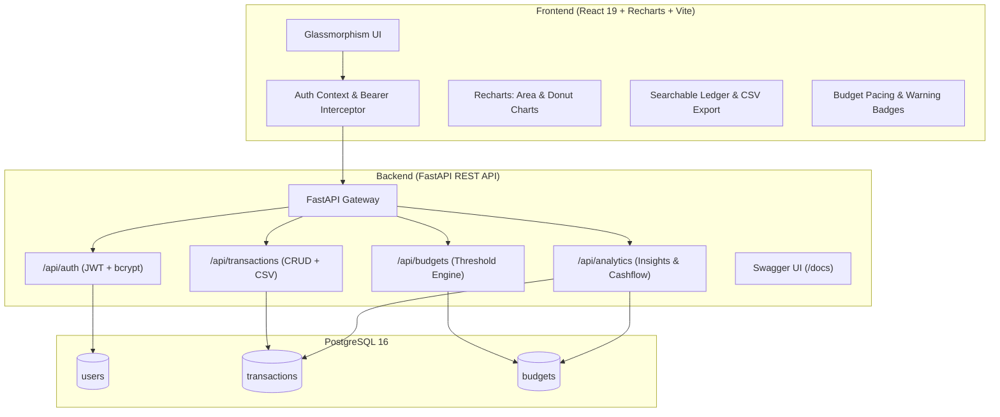

# 🚀 Smart Expense Tracker — Intelligent Financial Hub

[](https://fastapi.tiangolo.com)
[](https://react.dev)
[](https://www.postgresql.org)
[](https://www.sqlalchemy.org)
[](https://www.docker.com)
[](https://opensource.org/licenses/MIT)

> An enterprise-grade, full-stack personal finance application built with **FastAPI**, **PostgreSQL**, **SQLAlchemy**, **JWT Authentication**, and **React.js** with **Recharts**. Engineered far beyond a basic CRUD app into an intelligence-driven financial operations platform featuring real-time budget threshold warnings, cash flow trend projections, and automated spending insights.

---

## ✨ Features That Go Beyond Basic CRUD

- 🔐 **Secure JWT Authentication & Password Hashing**: Stateless authentication using industry-standard bcrypt encryption and JSON Web Tokens with OAuth2 compatibility.
- 📊 **Interactive Financial Telemetry (Recharts)**:
  - **Cash Flow Analysis**: Dual-gradient interactive Area Chart contrasting monthly inflows and outflows.
  - **Categorical Donut Distribution**: Real-time spending breakdown with interactive hover tooltips and dynamic color allocation.
- 🎯 **Smart Budget Threshold Engine**:
  - Set target monthly spending limits per category.
  - Automatic status alerts: **On Track** (`< 80%`), **Near Limit Warning** (`80% - 100%`), and **Exceeded** (`> 100%`).
- 💡 **Algorithmic Financial Insights**:
  - Heuristic analysis computing savings velocity, primary spending drivers, and budget pace anomalies.
  - Dynamic **Financial Vitality Score** (out of 100) assessing savings rate and diversification.
- 📑 **Comprehensive Transaction Ledger**:
  - Instant full-text search across titles, categories, and notes.
  - Multi-dimensional filters (Category, Type, Date ranges).
  - One-click **CSV Export** for tax, audit, and spreadsheet analysis.
- 🎨 **Sleek Dark Fintech Aesthetic**:
  - Built with pure Vanilla CSS, glassmorphism (`backdrop-filter: blur(16px)`), modern typography (Inter & Outfit), and responsive layout.
- 🐳 **Full Containerization & CI/CD**:
  - Dockerfiles for backend and frontend with multi-stage production builds.
  - Multi-container `docker-compose.yml` orchestrating PostgreSQL, FastAPI, and Nginx/React.
  - Automated GitHub Actions CI workflow.

---

## 🏗️ Architecture Overview



---

## 🛠️ Technology Stack

| Layer | Technology | Description |
|---|---|---|
| **Frontend** | React 19, Vite, Recharts, Lucide Icons | Responsive fintech dashboard with custom Vanilla CSS design tokens |
| **Backend** | FastAPI (Python 3.11/3.12/3.14) | High-performance asynchronous REST API with automatic OpenAPI generation |
| **Database** | PostgreSQL 16 | Relational data store with foreign key cascades and indexed queries |
| **ORM** | SQLAlchemy 2.0 | Declarative database modeling and query abstraction |
| **Auth** | JWT (`python-jose`) + `bcrypt` | Secure authentication, password hashing, and token validation |
| **DevOps** | Docker, Docker Compose, Nginx | Multi-stage container builds and production static serving |
| **CI/CD** | GitHub Actions | Automated pipeline testing backend endpoints and frontend build |

---

## 📁 Repository Structure

```
smart-expense-tracker/
├── backend/
│   ├── routers/
│   │   ├── auth_routes.py         # Register, Login, Me, Swagger Token
│   │   ├── transaction_routes.py  # CRUD, Filters, Search, CSV Export
│   │   ├── budget_routes.py       # Threshold engine & category limits
│   │   └── analytics_routes.py    # Overview, Cashflow, Categories, Insights
│   ├── auth.py                    # JWT creation, bcrypt hashing, get_current_user
│   ├── database.py                # SQLAlchemy engine & session maker
│   ├── models.py                  # User, Transaction, Budget models
│   ├── schemas.py                 # Pydantic request/response schemas
│   ├── seed_data.py               # Realistic demo data generator
│   ├── main.py                    # FastAPI application setup & CORS
│   ├── Dockerfile                 # Backend container definition
│   └── requirements.txt           # Python dependencies
├── frontend/
│   ├── src/
│   │   ├── api/client.js          # Fetch wrapper & API service functions
│   │   ├── context/AuthContext.jsx # Global persistent authentication
│   │   ├── components/
│   │   │   ├── Navbar.jsx         # Navigation tabs & user profile
│   │   │   ├── MetricCard.jsx     # Glassmorphic KPI cards
│   │   │   ├── CashFlowChart.jsx  # Recharts dual-gradient Area Chart
│   │   │   ├── CategoryPieChart.jsx # Recharts Donut & distribution list
│   │   │   ├── SmartInsightsCard.jsx# Intelligence recommendations feed
│   │   │   ├── TransactionTable.jsx # Search, filter, export table
│   │   │   ├── TransactionModal.jsx # Add/Edit transaction modal
│   │   │   └── BudgetModal.jsx    # Set category budget modal
│   │   ├── pages/
│   │   │   ├── AuthPage.jsx       # Login/Register with 1-click demo
│   │   │   ├── Dashboard.jsx      # Executive financial overview
│   │   │   ├── TransactionsPage.jsx# Complete transaction manager
│   │   │   ├── BudgetsPage.jsx    # Visual budget limits & pacing
│   │   │   └── AnalyticsPage.jsx  # Health score & deep dive metrics
│   │   ├── App.jsx                # Application root & view router
│   │   └── index.css              # Custom Vanilla CSS design system
│   ├── Dockerfile                 # Multi-stage frontend container
│   ├── nginx.conf                 # Nginx SPA & reverse proxy configuration
│   └── package.json
├── .github/workflows/ci.yml       # GitHub Actions CI pipeline
├── docker-compose.yml             # Full-stack multi-container composition
├── .env.example                   # Environment configuration template
└── README.md
```

---

## 🚦 Quickstart Guide

### Option 1: Docker Compose (Recommended)

Run the entire application (PostgreSQL + FastAPI + React) in one command:

```bash
# 1. Clone the repository
git clone https://github.com/<your-username>/smart-expense-tracker.git
cd smart-expense-tracker

# 2. Copy environment template
cp .env.example .env

# 3. Start all services
docker-compose up --build
```

- **Frontend App**: `http://localhost:3000`
- **FastAPI Backend**: `http://localhost:8000`
- **Interactive Swagger Docs**: `http://localhost:8000/docs`

---

### Option 2: Local Development

#### 1. Backend Setup

```bash
# Navigate to project root
cd smart-expense-tracker

# Create & activate virtual environment
python3 -m venv .venv
source .venv/bin/activate  # On Windows: .venv\Scripts\activate

# Install dependencies
pip install -r requirements.txt

# Seed realistic demo data (creates Ashvitha demo account with transactions)
python backend/seed_data.py

# Start FastAPI development server
uvicorn backend.main:app --reload --port 8000
```

#### 2. Frontend Setup

```bash
# In a new terminal tab:
cd smart-expense-tracker/frontend

# Install dependencies
npm install

# Start Vite development server
npm run dev
```

Open `http://localhost:5173` in your browser!

---

## 🧪 Demo Credentials

For instant exploration without typing, click **"Try Demo"** on the login screen, or use:

- **Email**: `ashvitha@example.com`
- **Password**: `password123`

---

## 📡 REST API Documentation

Interactive documentation is available out of the box at `http://localhost:8000/docs`:

| Method | Endpoint | Description | Auth Required |
|---|---|---|---|
| `POST` | `/api/auth/register` | Register a new user account | No |
| `POST` | `/api/auth/login` | Log in and receive JWT token | No |
| `POST` | `/api/auth/token` | OAuth2 form login for Swagger UI | No |
| `GET` | `/api/auth/me` | Retrieve authenticated user profile | Bearer Token |
| `GET` | `/api/transactions` | Filter, search, and paginate transactions | Bearer Token |
| `POST` | `/api/transactions` | Record a new income or expense | Bearer Token |
| `PUT` | `/api/transactions/{id}` | Update existing transaction | Bearer Token |
| `DELETE` | `/api/transactions/{id}` | Delete transaction | Bearer Token |
| `GET` | `/api/transactions/export/csv` | Download transactions as CSV file | Bearer Token |
| `GET` | `/api/budgets` | List category budgets with spent vs limit status | Bearer Token |
| `POST` | `/api/budgets` | Set or update monthly budget limit | Bearer Token |
| `DELETE` | `/api/budgets/{id}` | Delete category budget | Bearer Token |
| `GET` | `/api/analytics/overview` | KPI overview (balance, income, expense, rate) | Bearer Token |
| `GET` | `/api/analytics/cashflow` | Monthly inflow vs outflow for charts | Bearer Token |
| `GET` | `/api/analytics/categories`| Categorical expense breakdown & colors | Bearer Token |
| `GET` | `/api/analytics/insights` | Algorithmic smart spending insights | Bearer Token |

---

## 🗺️ Roadmap & Future Enhancements

- [x] JWT Authentication & bcrypt security
- [x] Multi-user data isolation
- [x] Recharts Area and Donut visualization
- [x] Budget threshold engine (`Safe` / `Warning` / `Exceeded`)
- [x] CSV Export endpoint
- [x] Algorithmic spending insights
- [x] Docker & Docker Compose setup
- [ ] AI-assisted receipt OCR scanning (FastAPI + Tesseract / Vision model)
- [ ] Automated recurring bill reminders & webhook alerts
- [ ] Multi-currency real-time exchange rate conversion

---

## 📄 License

Distributed under the MIT License. See `LICENSE` for more information.
